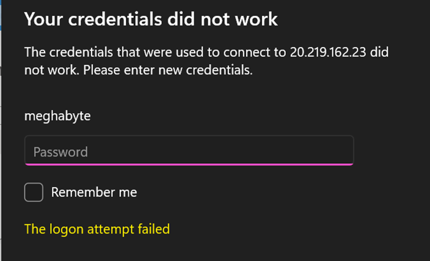
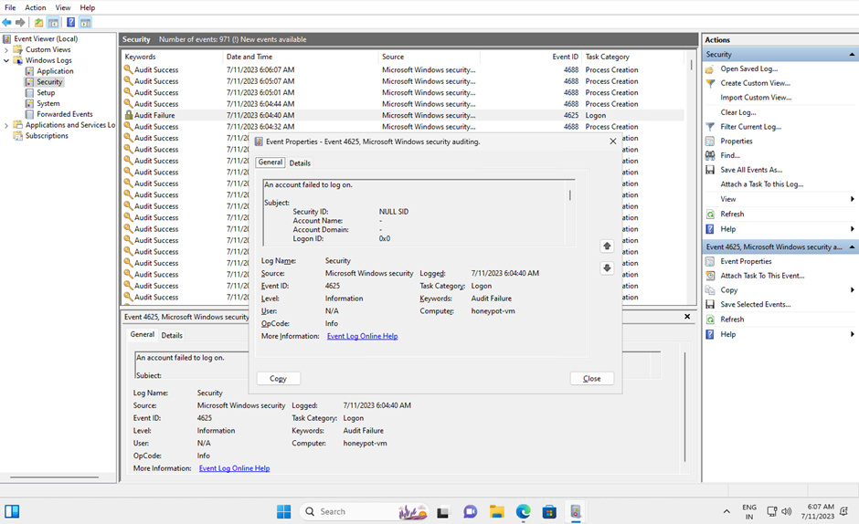
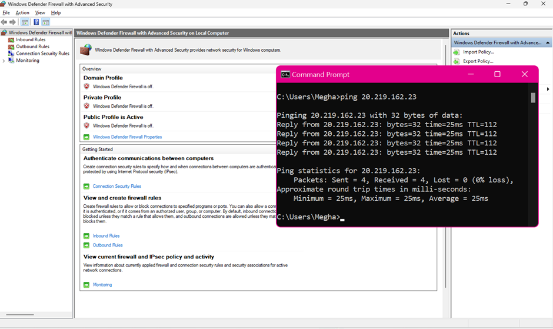
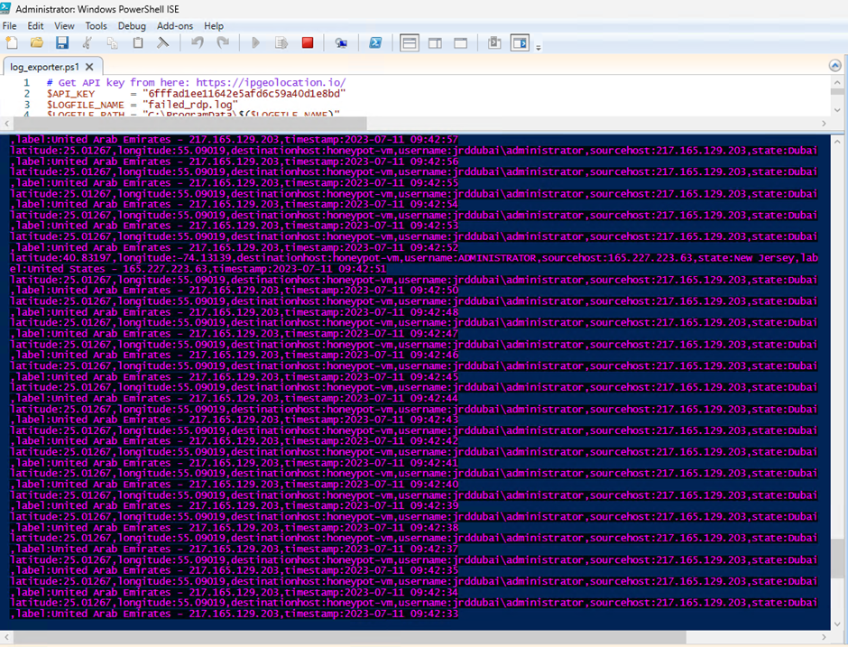
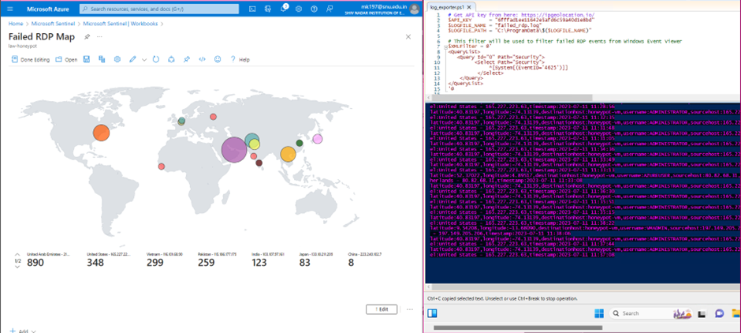
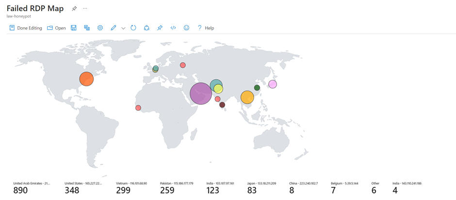

# SEIM

## SEIM(Security Information and Event Management) Project Overview
The SEIM (Security Information and Event Management) project is aimed at enhancing security monitoring and threat detection within a Microsoft Azure environment. By leveraging Azure services and custom scripts, the project enables the visualization and analysis of attacks originating from different geographical locations, providing valuable insights into potential security threats.

## Key Features

1. **Azure Virtual Machine and Resource Group Creation**: The project begins by provisioning a virtual machine (VM) and a corresponding resource group using Microsoft Azure. These resources serve as the foundation for visualizing and analyzing simulated attacks.
Log Analytics Workspace: A Log Analytics workspace is created to facilitate the ingestion and storage of logs generated by the VM. This workspace acts as a centralized repository for security event data.

2. **Custom Log Creation**: Custom logs are implemented within the VM to capture and identify attack origins geographically. These logs contain information required to pinpoint the location of potential attackers.

3. **SEIM Integration**: The SEIM component connects to the Log Analytics workspace to extract and display geolocation data. By integrating with the workspace, the project enables the visualization of attack origins on a world map, providing a comprehensive view of security events.

4. **Microsoft Sentinel Integration**: Microsoft Sentinel, a cloud-native SIEM system, is integrated with the Log Analytics workspace. This integration further enhances the capabilities of the SEIM solution by providing advanced security analytics, threat intelligence, and visualization tools.

## Test Scenario and Geolocation Mapping

As part of the testing process, a specific test case was conducted to evaluate the SEIM solution's functionality. By logging into the VM using the public IP address and intentionally entering an incorrect password, the project simulated an unauthorized login attempt. This action triggers the creation of an audit failure log, which captures the IP address of the system attempting to access the VM.

To track the location of the attacking system, a PowerShell script was developed. The script utilizes the [geolocation.io](https://ipgeolocation.io/ "IPGeolocation Homepage") to retrieve latitude, longitude, and general area information associated with the IP address. This geolocation data is then used to plot the attack origins on a world map, providing a visual representation of the security events.

### Firewall Configuration and Accessibility
During the testing phase, the VM's firewall was temporarily disabled to ensure easy accessibility for testing purposes. It is important to note that this configuration is not recommended for production environments, and proper security measures should be implemented.

### PowerShell Script Functionality
The core functionality of the project relies on a PowerShell script that continuously scans the security logs generated by the VM. The script extracts IP addresses from the logs, retrieves geolocation data for each address using [geolocation.io](https://ipgeolocation.io/ "IPGeolocation Homepage"), and creates a new log file enriched with this information. The script automates the process of tracking and analyzing potential security threats, enhancing the efficiency of the SEIM solution.

### Visualization and Analysis
To visualize the gathered data, a custom log was created in Azure to store information about all failed login attempts to the system. The raw data from the log was extracted and processed to separate the relevant information into individual columns, including latitude and longitude. The Microsoft Sentinel workbook was utilized to present the geolocation data on a world map, providing an intuitive and comprehensive overview of the attacks.

### SEIM World Map Visualization

The SEIM project is an ongoing endeavor, continuously collecting and analyzing security event data. The information presented in the screenshot provides an initial update.

 Note: The SEIM project serves educational and testing purposes and should be adapted and deployed with appropriate security considerations for production environments.